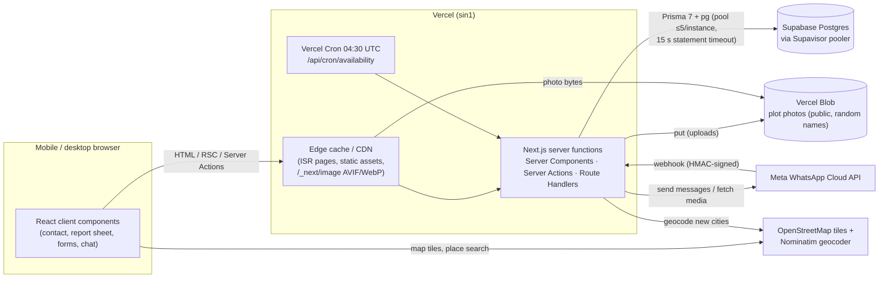
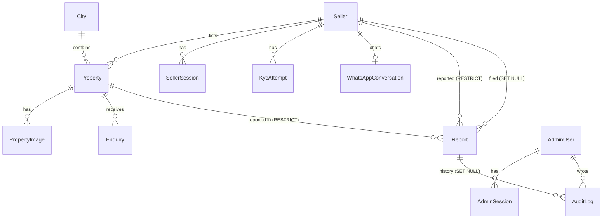

# Plots — Architecture

How the system actually works today (Oct 2026). For findings, fixes and the scaling plan see [ARCHITECTURE_REVIEW.md](ARCHITECTURE_REVIEW.md); for security see [SECURITY.md](SECURITY.md).

## 1. System overview

One Next.js 16 application (App Router, React 19, TypeScript), deployed on Vercel (region `sin1`). It is a modular monolith: there are no other services. Postgres on Supabase is the single source of truth, including for rate limits and the audit log.



| Concern | Where it lives |
|---|---|
| Pages and UI | `src/app/(site)` (public + seller), `src/app/admin` (staff), `src/components/*` |
| Domain logic | `src/server/*` — `listings/service.ts` (listing state machine), `listings/queries.ts`, `seller/*`, `reports/*`, `whatsapp/*`, `kyc/*`, `cities.ts`, `audit.ts`, `maintenance.ts` |
| Mutations | Server Actions in `src/server/actions/**` (thin: auth → validate → call domain) and Route Handlers in `src/app/api/**` |
| Cross-cutting | `src/lib/*` — `db.ts`, `rate-limit.ts`, `request-ip.ts`, `log.ts`, `listing-visibility.ts`, `seller/session.ts`, `admin/{session,require,mfa}.ts`, `env-check.ts` |
| Schema and migrations | `prisma/schema.prisma`, `prisma/migrations/*` (versioned SQL, reviewed by hand) |

## 2. Request flows

**Buyer opens a plot** (`/property/[slug]`, ISR):

1. The CDN serves the cached HTML, which is refreshed every 60 s or immediately when the plot's status changes.
2. On a cache miss, the server function runs `getListingBySlug` → `isPubliclyViewable` → render.
3. Photos come from `/_next/image` (AVIF/WebP, sized per device), fetched from Blob.
4. The browser then:
   - posts a view beacon (`/api/properties/[id]/view`, rate limited);
   - loads the map near the viewport;
   - for WhatsApp/Call, posts `/api/enquiries` (rate limited, logged) and opens `wa.me`/`tel:` directly. The seller notification is sent after the response (`after()`).

**Buyer searches** (`/search`, rendered per request):

1. `loading.tsx` shows a skeleton instantly.
2. `parseSearchParams` allowlists and clamps the URL.
3. One `count` and one `findMany` run with an indexed default sort, 12 per page, capped at 500 pages.

**Seller lists a plot**:
- **Web:** OTP sign-in → `createSellerListing` (session, validation, rate limit) → `createListing` (PENDING) → an admin approves.
- **WhatsApp:** Meta → `POST /api/whatsapp/webhook` (HMAC verified, 200 at once) → `after()` → `processInbound` (de-duplicated by message id) → bot state machine → `createListing`.

**Status changes**: every path calls `changeListingStatus` (`src/server/listings/service.ts`): admin, seller dashboard, WhatsApp bot and the daily cron. It's the only writer of listing status:
- writes are compare-and-set;
- a suspended seller's plot can't go live;
- cached pages are refreshed.

**Reports**: the report sheet calls the `reportAction` Server Action.
- `submitReport` resolves the target from trusted records and checks the visibility rule.
- It de-duplicates per reporter and target (unique `dedupeKey`) and applies rate limits.
- Admins work reports in `/admin/reports`; every action is written to `audit_logs`.

**Daily cron** (`/api/cron/availability`, `CRON_SECRET`):
- sends weekly availability checks and hides plots that went unanswered (through `changeListingStatus`);
- prunes expired sessions, OTPs, rate-limit counters and login attempts.

## 3. Data model (key relationships)



**Integrity rules enforced in the database:**

| Rule | How |
|---|---|
| One account per phone number; one profile URL per seller | Unique `sellers.phone`, `sellers.code`, `sellers.profileSlug` |
| Unique plot identifiers | Unique `properties.code`, `properties.slug` |
| One open report per reporter per target | Unique `reports.dedupeKey`, cleared when the report closes |
| A listing report must name a plot | CHECK `reports_target_matches` |
| An "Other" report needs a real description | CHECK `reports_other_needs_description` |
| Bounded text sizes | Length CHECKs on report descriptions and audit notes |
| Moderation evidence can't disappear | `RESTRICT` foreign keys from reports to plots and sellers, plus label snapshots on each report |
| History is never rewritten | `audit_logs` uses plain-string target ids (no FK) and is append-only |
| Supabase's public API roles see nothing | RLS is enabled on every table with no policies; the app connects as the owner. **Authorization is enforced in the app.** |

**Listing lifecycle** (only `changeListingStatus` writes it):

```
PENDING ──approve──▶ ACTIVE ──mark sold──▶ SOLD ──relist / YES──▶ ACTIVE
   │                   │ ├─hide (seller/admin)──▶ HIDDEN(BY_*) ──unhide──▶ ACTIVE
   └──reject──▶ REJECTED │ └─no reply to weekly check──▶ HIDDEN(AVAILABILITY_UNCONFIRMED) ──YES──▶ ACTIVE
                         └─(seller edits) ──▶ PENDING again (same transaction as the edit)
```

**Public visibility** is decided in one place, `src/lib/listing-visibility.ts`:
- Live and sold plots are viewable.
- Plots paused for "no reply" are viewable, shown as "not available" with no contact buttons.
- Plots hidden by the seller or an admin, unpublished plots, and anything from a suspended seller are not viewable.

Search, home and profile pages list `ACTIVE` plots only. A suspended seller has no `ACTIVE` plots: suspending hides them, and they can't be made live again.

## 4. Authentication, authorization, trust boundaries

| Actor | Proof | Session | Checked by |
|---|---|---|---|
| Buyer | none | none | public routes only, rate limits per trusted IP |
| Seller | WhatsApp OTP (scrypt-hashed codes) | 256-bit random token, SHA-256 stored, httpOnly SameSite=Lax cookie, 30 days | `requireSeller()` / `getSellerSession()`; every query scoped by `sellerId` |
| Admin | email + scrypt password + optional TOTP | same design, 14 days | `requireAdmin()` on every admin page and action (also enforces `ADMIN_REQUIRE_MFA`) |
| Cron | `CRON_SECRET` bearer | — | constant-time compare |
| Meta | HMAC-SHA256 of raw body | — | `WHATSAPP_APP_SECRET` |

Trust boundaries:
- **Browser → server:** everything from the client is validated. Ids name only *which* public object. Ownership, sellers and roles always come from the server.
- **Server → DB:** owner credentials, parameterized queries only.
- **Server → Meta/OSM:** fixed hosts, timeouts, size caps.

## 5. Caching and freshness

| Content | Strategy | Invalidation |
|---|---|---|
| Home, city, city×type pages | ISR, 60 s | `revalidatePath` on every status change and seller suspension |
| Plot page | ISR on first visit (`generateStaticParams → []`), 60 s | same; a plot that disappears returns 404 immediately |
| Seller profile `/sellers/…` | rendered per request | — |
| Search | rendered per request (unbounded query space; no shared cache) | — |
| Seller/admin pages, APIs | per request; Next sends `private, no-store` | — |
| Photos | `/_next/image` + CDN; Blob objects are immutable with random names | — |
| Sitemap | 1 h | — |

Shared caches only hold pages without per-visitor content. Contact, report and view-counting run in the browser.

## 6. External integrations and failure behaviour

| Dependency | If it fails |
|---|---|
| Postgres | Requests fail with the generic error page. The pool waits ≤5 s for a connection and queries ≤15 s. `/api/health` returns 503. |
| WhatsApp (send) | One retry, only for network errors (never after an HTTP response, to avoid double-sends), 10 s timeout. Failure is logged. The status change still stands, and admins see "not delivered". |
| WhatsApp (webhook) | 200 as soon as the signature is valid. Processing runs after the response. Meta retries are de-duplicated by message id. A processing error is logged; the message stays in the inbox for an admin. |
| OTP delivery | The code is stored only if the send succeeded, so no cooldown is burnt on a failed send. |
| Nominatim | 4 s timeout. New-city creation falls back to "not found" and the user retypes. |
| Blob / image processing | Upload returns a 4xx/5xx message; nothing is saved. |
| Rate-limit table | Fails open (logged), so the limiter never takes the site down. |
| KYC provider | Only a mock exists. A real provider plugs into `server/kyc/provider.ts`, and outcomes are fetched server-side, never read from redirects. |

## 6a. WhatsApp assistant: language and optional AI

- **Language.** A new chat starts with "English / हिंदी" (stored on `whatsapp_conversations.language`); *LANGUAGE* / *भाषा* switches anytime. Every message, including notifications, comes from `src/server/whatsapp/copy.ts` in the seller's language. Hindi replies ("हाँ", "नहीं 2", "२ बीघा", "18 लाख", state names in Devanagari) are understood. A city typed in Hindi is matched to its English name via OpenStreetMap, so it never creates a duplicate city. Older chats continue in English.
- **Sellers only.** The assistant no longer asks owner vs broker; everyone is a seller (the stored field stays for older records).
- **Optional AI agent** (`src/server/ai`). Off unless `AI_ENABLED=true` and a real `AI_API_KEY` exist. Providers: OpenAI, Anthropic Claude, xAI Grok, Gemini (OpenAI endpoint), Groq, OpenRouter, or any OpenAI-compatible URL, all through plain `fetch`. When on, the AI reads typed messages first (`aiAgent` in `bot.ts`) with the current question, what's known so far and the last 10 messages, and returns an intent, listing details and a short reply:
  1. *Intents.* answer, correction, yes/no, question, small talk, sell, buy, status, sold, talk to a person, stop. The bot maps each to its own safe steps (save the answer, update an earlier answer, tap-equivalent buttons, start a pre-filled listing, show status, hand over, link buyers to the right city page, ask before stopping).
  2. *Details.* Pulled out of free-form messages ("2 bigha khet Azamgarh 18 lakh") and validated like typed answers; questions already answered are skipped.
  3. *Reply.* A short, respectful reply in the language the seller writes in (Hinglish stays Hinglish), followed by the open question.
  - Short plain answers on structured questions ("2 bigha", "18 lakh", "done") skip the AI; free-text questions (name, city, village, description) and anything with "?" or more than 4 words go to it. Without AI, "kya bhai" / "who are you" are still rejected as a name or village.
- **AI guardrails:**
  - It can't take actions; listings are still reviewed by our team.
  - Phone and Aadhaar-like numbers are masked before sending, and only links to our own site are kept in replies.
  - Calls time out after 8 s and are capped per chat and per day (Postgres limiter).
  - Any failure falls back to the fixed reply.
  - Prompts and replies are never logged.

## 7. Deployment and migrations

- Push to `main`:
  1. GitHub CI runs typecheck, lint, the unit/DB/HTTP checks, build, dependency audit, gitleaks and CodeQL.
  2. Vercel runs `vercel-build`, which does `prisma migrate deploy` then `next build`.
- If a migration fails, the build fails and the previous deployment stays live.
- **Migrations land before new code goes live, but old code keeps serving during the build.** So every migration must be backward-compatible with the running code (expand → deploy → contract in a later release). Never drop or rename a column in the same release that stops using it.
- **Rollback:**
  - Code: Vercel "Promote" a previous deployment (instant).
  - Database: write a forward-fix migration. Prisma has no down-migrations, and restoring a backup loses newer data.
- Dependabot PR branches are not built by Vercel (no database in Preview). Any other Preview build would need its own database.
- Production env vars are validated at start-up (`src/lib/env-check.ts`).

## 8. Observability

- **Logs:** structured JSON lines (`src/lib/log.ts`), filterable by `event` in Vercel Logs. Sensitive fields are dropped automatically. Events include:
  - `request.unhandled_error` (every server error, with route and digest)
  - `rate_limited`, `rate_limit.unavailable`
  - `upload.failed`
  - `whatsapp.inbound_failed`
  - `audit.write_failed`
  - `maintenance.prune_failed`
  - `cron.availability_done`
- **Request correlation:** Vercel adds `x-vercel-id` to every request; its logs group lines per request.
- **Health:** `GET /api/health` returns `{status: ok|degraded}` and nothing else. Point an uptime monitor at it.
- **Moderation and admin activity:** `audit_logs`, visible per report and per plot/seller in the admin.

## 9. Backups and data lifecycle

These are recommendations; **verify them in the dashboards.**

- **Database:** Supabase backups depend on the plan. Point-in-time recovery is a paid add-on. Recommended targets: RPO ≤ 24 h now (daily backups), ≤ 5 min once paying sellers depend on it (PITR); RTO ≤ 4 h.
- **Restore drill:** restore into a separate Supabase project, run `pnpm check:integrity` against it, then delete it.
- **Photos:** Blob has no versioning. The app never deletes blobs, so DB restores keep their photos; a lost blob is lost. If photos become critical, mirror them periodically to a second bucket.
- **Retention:**
  - Expired sessions, OTPs, login attempts and rate-limit counters are pruned daily.
  - Reports and audit logs are kept indefinitely (moderation evidence).
  - Analytics events grow unbounded. Decide on a retention period (e.g. 18 months) when the table reaches millions of rows.

## 10. Future: land-intelligence map (not built)

The current design can absorb it without a rewrite:

- **Separate domain.** New tables, e.g. `parcels` (state, district, tehsil, village, survey/khasra/gata number, geometry, `source`, `source_ref`, `fetched_at`, `licence`), `parcel_sources` and `parcel_snapshots`. Government/cadastral data never goes into `properties`.
- **Explicit link.** `listing_parcel_links(property_id, parcel_id, method: 'verified_id' | 'spatial_match' | 'seller_claim', confidence, verified_by, verified_at)`. Link only on a reliable identifier or a verified spatial match. Show provenance in the UI.
- **Per-state adapters.** Each state's land-records source sits behind one interface (like `KycProvider`), with its own licence and terms.
- **Spatial support when it ships.** Enable PostGIS on the same Supabase Postgres (`geometry` columns, GiST indexes). `properties.latitude/longitude` stays the coarse marketplace location, and the public approximate-location privacy rule stays.
- **Not now.** No PostGIS, GIS service or map microservice until the feature is actually built.
- **Tried once (Oct 2026), then removed.** A standalone `/land-map` prototype was built and removed at the owner's request; its tables were dropped by `20261012090000_remove_land_parcel_map`. Findings worth keeping:
  - Survey of India village boundaries for Uttar Pradesh are openly downloadable from the National Water Data Portal (EPSG:7755; reuse allowed with acknowledgement).
  - Plot (Gata) polygons in UP Bhu-Naksha are not offered for bulk reuse. They need the Revenue Department's or NIC's permission.

## 11. URLs

Public pages:

| Page | URL |
|---|---|
| Home | `/` |
| Search | `/search` |
| A city | `/<city>` |
| A city and land type | `/<city>/<land-type>` |
| A property | `/property/<slug>`, for example `/property/2-bigha-agricultural-land-in-sathiyaon-azamgarh-tnrp4h` |
| A seller's page | `/sellers/<slug>` |
| All cities | `/cities` |
| Selling: overview | `/sell` |
| Selling: register | `/sell/start` |
| Selling: assistant chat | `/sell/chat` |
| Privacy Policy | `/privacy-policy` |
| Terms of Service | `/terms` |
| Data deletion | `/data-deletion` |

Seller area, all under `/seller/` and not indexed:

| Page | URL |
|---|---|
| Login | `/seller/login` |
| Dashboard | `/seller/dashboard` |
| Add a property | `/seller/properties/new` |
| Edit a property | `/seller/properties/<code>/edit`, using the property code, for example `p-tnrp4h` |
| After submitting | `/seller/properties/submitted` |
| Identity check | `/seller/verify` |

Older URLs redirect permanently in `next.config.ts`, so links already shared on WhatsApp keep working:

| Old URL | Now goes to |
|---|---|
| `/s/<slug>` | `/sellers/<slug>` |
| `/seller` | `/seller/login` |
| `/seller/plots/…` | `/seller/properties/…` |

An edit link that uses an internal id redirects to the URL with the property code.

## 12. Launch programmes

**Founding Sellers** (`src/server/founding.ts`). The first 100 sellers to get a listing approved get a numbered badge and come first in the "Recommended" sort. A spot is claimed when a listing goes live (admin approval or an admin publishing it), never at sign-up, so empty accounts can't use spots up. Claims are serialised with a transaction-scoped Postgres advisory lock, numbers continue from the highest given out, and a unique index plus CHECK constraints back this up. Home and `/sell` show the real count of spots left.

**Buyer requests** (`src/server/buyer-requests.ts`, `POST /api/buyer-requests`). "Tell us what you need" saves a buyer's name, number, place and preferences. One row per number + place, so repeat taps update instead of inflating demand. The API checks Origin, caps requests per IP, per number and site-wide, and accepts only letters and simple punctuation (no links or digits in names). `/sell` shows how many distinct buyers are waiting and where, only once there are a few, and never who. The team works the list at `/admin/buyers` and WhatsApps buyers when matching land is listed.

**Legal pages** read the operator name, email, address and grievance officer from `NEXT_PUBLIC_LEGAL_NAME`, `NEXT_PUBLIC_CONTACT_EMAIL`, `NEXT_PUBLIC_BUSINESS_ADDRESS` and `NEXT_PUBLIC_GRIEVANCE_OFFICER`; empty ones are left out. They describe what the code actually does, so update them when data handling changes.

